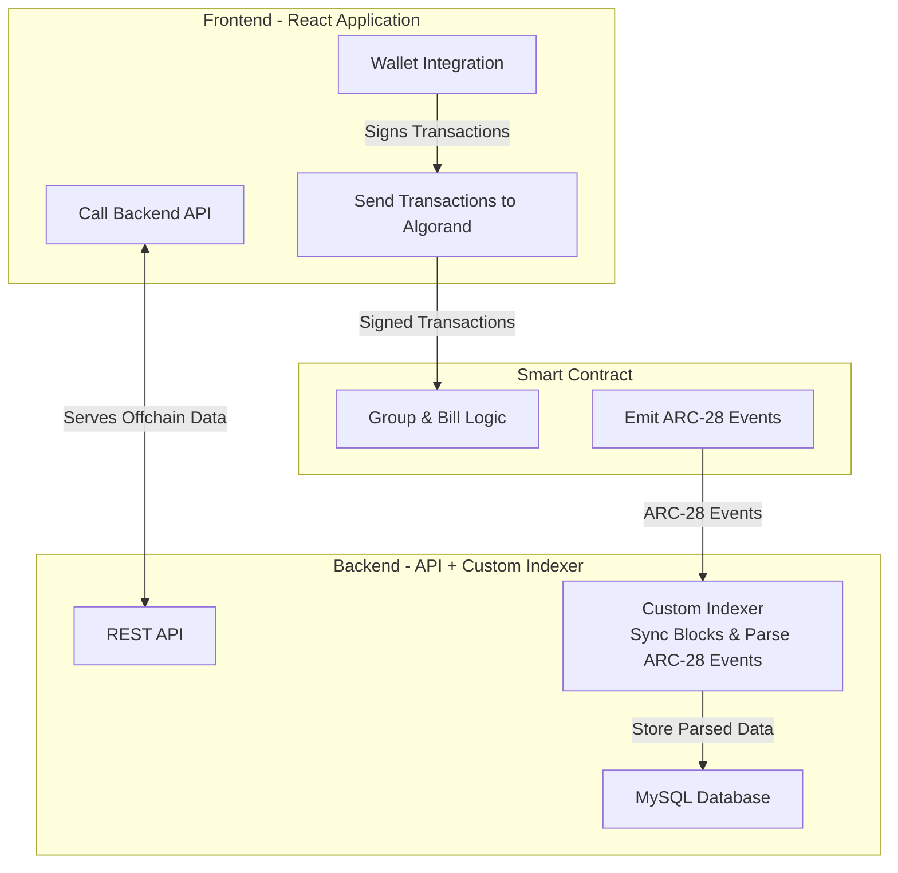
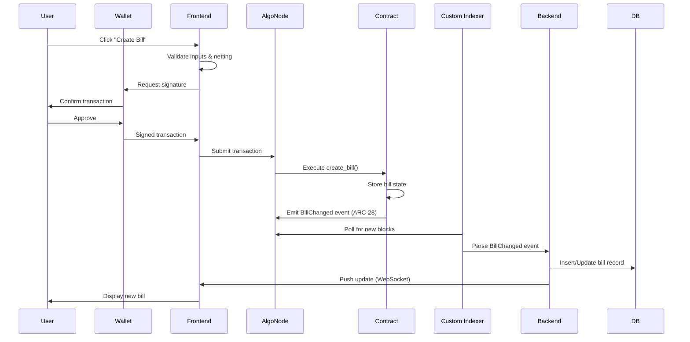

# Splitrix - Algorand-Powered Group Expense Splitting

**Splitrix** is a decentralized application (dApp) for splitting bills and managing group expenses on the Algorand blockchain. Built with smart contracts (ARC-4/puya-py), an event-driven indexer backend, and a modern React frontend, Splitrix ensures transparent, verifiable, and efficient expense management with advanced debt netting capabilities.

[]() []() []()

---

## 🎯 Project TL;DR

**Purpose:** Simplify group expense splitting with blockchain transparency, automated netting, and real-time synchronization.

**Tech Stack:**

- **Smart Contract:** Algorand ARC-4 (Algorand Python - puya-py) with ARC-28 event emission
- **Backend:** Node.js + TypeScript, Prisma ORM, MySQL database
- **Custom Indexer:** Event-driven block scanner for ARC-28 events
- **Frontend:** React + Next.js + Vite, wallet integration (Pera, Defly, Lute)
- **Database:** MySQL with Prisma schema

## 🔐 Contract Deployment & Verification

**Deployed Contract Information:**

- **App ID:** `749724159`
- **Network:** Algorand TestNet
- **Contract Address:** `LGOX77WSBN32DR2FBDBOWVRKV545OKKJBJXDQNVSRVN4ZJZB4OPLSIGUNQ`
- **ABI:** [See ABI](projects/splitrix-algorand-contracts/smart_contracts/artifacts/splitrix/Splitrix.arc56.json)

**Verification Steps:**

1. Visit [Lora App Lab](https://lora.algokit.io/testnet/app-lab)
2. Create a new app interface using `Use Existing App` section using deployed App Id `749724159` and select [this abi](projects/splitrix-algorand-contracts/smart_contracts/artifacts/splitrix/Splitrix.arc56.json)
3. Open Below Transaction Links

Create Group Transaction Link:
[https://lora.algokit.io/testnet/transaction/M4VETIS5DYXRCFEFPM64P2VC5B3VIJVKRVT4CWJPQGGDHHP5QQPQ](https://lora.algokit.io/testnet/transaction/M4VETIS5DYXRCFEFPM64P2VC5B3VIJVKRVT4CWJPQGGDHHP5QQPQ)

Create Bill Transaction Link:
[https://lora.algokit.io/testnet/transaction/7ZJC3WVF465YWOY2AXAOFE4PYXYEKO64Y4FPA5BHEUSNXGKNEPDQ](https://lora.algokit.io/testnet/transaction/7ZJC3WVF465YWOY2AXAOFE4PYXYEKO64Y4FPA5BHEUSNXGKNEPDQ)

Settle Bill Transaction Link:
[https://lora.algokit.io/testnet/block/57561833/group/ClzEwFHJC4RwtbrkKQDll%2B2QD%2Fem6oq2Yl%2FaSp%2BopuQ%3D](https://lora.algokit.io/testnet/block/57561833/group/ClzEwFHJC4RwtbrkKQDll%2B2QD%2Fem6oq2Yl%2FaSp%2BopuQ%3D)

**Smart Contract Deployment Steps:**

```bash
cd projects/splitrix-algorand-contracts
algokit project bootstrap all
algokit project run build
algokit project deploy localnet
# Note the App ID from output and update .env files
```

**Repo Structure:**

```
splitrix-algorand/
├── projects/
│   ├── splitrix-algorand-contracts/    # Smart contract (ARC-4/puya-py)
│   ├── splitrix-algorand-backend/      # Custom Indexer + API server
│   └── splitrix-algorand-frontend/     # React UI + wallet integration
├── docs/
│   └── diagrams/                       # Architecture & flow diagrams
├── README_root.md                      # This file
├── README_frontend.md                  # Frontend-specific docs
└── README_backend.md                   # Backend-specific docs
```

---

## 🚀 Quick Start

Clone and set up the entire project in minutes:

```bash
# Clone the repository
git clone https://github.com/NandhaReddy8/Splitrix
cd Splitrix

# Backend setup
cd projects/splitrix-algorand-backend
pnpm install
# Create MySQL database named "splitrix"
mysql -u root -p -e "CREATE DATABASE splitrix;"
# Copy .env.sample to .env and configure
cp .env.sample .env
# Run Prisma migrations
pnpm prisma:migrate
# Start backend
pnpm dev

# Frontend setup (in new terminal)
cd projects/splitrix-algorand-frontend
pnpm install
# Copy env.example to .env and configure
cp env.example .env
# Start frontend
pnpm dev
```

**Environment Variables:**

- Backend: `INDEXER_URL`, `ALGOD_URL`, `ALGOD_TOKEN`, `DATABASE_URL`, `PORT`
- Frontend: `NEXT_PUBLIC_ALGOD_URL`, `NEXT_PUBLIC_INDEXER_URL`, `NEXT_PUBLIC_APP_ID`, `NEXT_PUBLIC_API_URL`

---

## 📊 Architecture Overview



---

## 🔄 Data Flow: Creating & Settling a Bill



---

## 📜 Smart Contract: ABI Methods & Events

### Structs

| Struct          | Fields                                                                                                                                              | Description                                                                  |
| --------------- | --------------------------------------------------------------------------------------------------------------------------------------------------- | ---------------------------------------------------------------------------- |
| `Group`         | `admin: Address`, `bill_counter: UInt64`, `members: Address[]`                                                                                      | Represents a group of members who can split bills.                           |
| `Debtor`        | `debtor: Address`, `amount: UInt64`, `paid: UInt64`                                                                                                 | Represents a debtor in a bill, including the amount paid.                    |
| `DebtorMinimal` | `debtor: Address`, `amount: UInt64`                                                                                                                 | A minimal representation of a debtor used for creating bills.                |
| `Bill`          | `payer: Address`, `total_amount: UInt64`, `debtors: Debtor[]`, `memo: String`                                                                       | Represents a bill, including the payer, total amount, and list of debtors.   |
| `BillKey`       | `group_id: UInt64`, `bill_id: UInt64`                                                                                                               | A unique key to identify a bill within a group.                              |
| `PayerDebt`     | `bill_id: UInt64`, `bill_payer: Address`, `payer_index_in_bill_debtors: UInt64`, `amount_to_cutoff: UInt64`, `debtor_index_in_current_bill: UInt64` | Used for netting to specify a previous debt to be offset against a new bill. |

### ABI Methods

| Method         | Inputs                                                                                                                               | Outputs                  | Description                                                      |
| -------------- | ------------------------------------------------------------------------------------------------------------------------------------ | ------------------------ | ---------------------------------------------------------------- |
| `create_group` | `admin: Address`, `members: Address[]`                                                                                               | `group_id: UInt64`       | Creates a new expense group.                                     |
| `create_bill`  | `group_id: UInt64`, `payer: Address`, `total_amount: UInt64`, `debtors: DebtorMinimal[]`, `memo: String`, `payers_debt: PayerDebt[]` | `bill_id: UInt64`        | Creates a bill with advanced netting.                            |
| `settle_bill`  | `group_id: UInt64`, `bill_id: UInt64`, `sender_index: UInt64`, `payment: PaymentTransaction`                                         | `None`                   | Settles a specific debt in a bill via a payment transaction.     |
| `get_group`    | `group_id: UInt64`                                                                                                                   | `None` (logs group data) | Retrieves and logs group details. Readonly.                      |
| `get_bill`     | `bill_key: BillKey`                                                                                                                  | `None` (logs bill data)  | Retrieves and logs bill details. Readonly.                       |
| `get_groups`   | `group_ids: UInt64[]`                                                                                                                | `None` (logs group data) | Retrieves and logs details for multiple groups. Readonly.        |
| `get_bills`    | `bill_keys: BillKey[]`                                                                                                               | `None` (logs bill data)  | Retrieves and logs details for multiple bills. Readonly.         |
| `gas`          | -                                                                                                                                    | -                        | Empty method to increase opcode budget for complex transactions. |

### ARC-28 Events

| Event          | Payload             | Description                                                                               |
| -------------- | ------------------- | ----------------------------------------------------------------------------------------- |
| `GroupCreated` | `group_id: UInt64`  | Emitted when a new group is created.                                                      |
| `BillChanged`  | `bill_key: BillKey` | Emitted when a bill is created or its state is updated (e.g., via netting or settlement). |

---

## 🛡️ Security & Integrity: Why Use an Custom Indexer?

The backend custom indexer is critical for Splitrix's performance and security:

**Why an Indexer?**

- **Off-chain Computation:** Complex netting calculations and debt aggregation happen off-chain for speed
- **Performance:** Querying blockchain state directly is slow; the indexer caches data in MySQL for instant access
- **Queryability:** Enables complex queries (e.g., "show all unsettled bills for user X") that are impractical on-chain
- **ARC-28 Event Listening:** Ensures on-chain integrity by listening to contract-emitted events, not trusting user input
- **Auditability:** Every state change is traceable via events, providing a verifiable audit trail

**Event → DB Mapping Example:**
When the contract emits a `BillChanged` event, the indexer:

1. Parses the event payload from the transaction log
2. Validates the event signature and App ID
3. Extracts bill data (group_id, bill_key, payer_debts, etc.)
4. Inserts/updates the `bills` table in MySQL
5. Served Updated Data to the frontend via RestAPI

This architecture ensures the frontend displays only verified, on-chain data while maintaining fast UX.

---

## 🎬 How to Demo in 60 Seconds

1. **Start the stack:** Run backend + frontend locally (see Quick Start)
2. **Connect wallet:** Open frontend, connect Pera/Defly/Lute wallet
3. **Create & settle:** Create a group → Add a bill with netting → Settle a debt → See real-time updates

---

**What I think / why this matters:**
Transparent, blockchain-based expense splitting eliminates trust issues in group finances. Splitrix proves that DeFi primitives can solve everyday problems with better UX than traditional apps.
