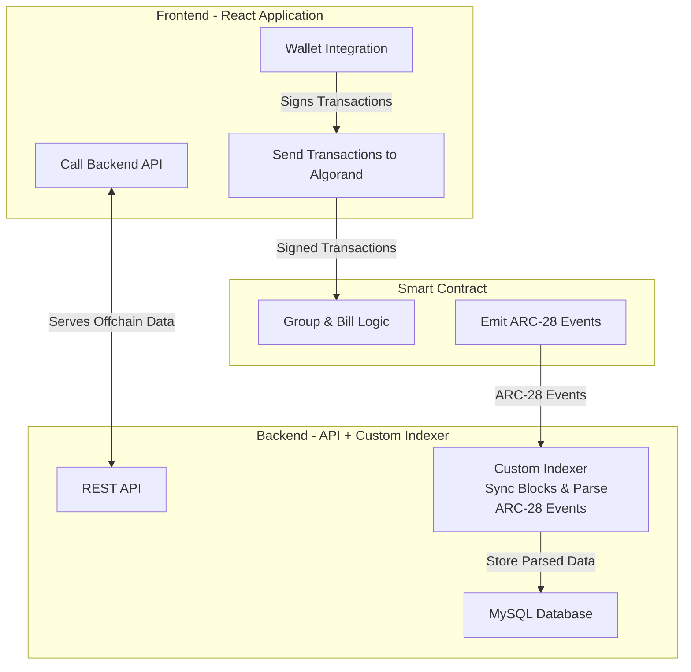
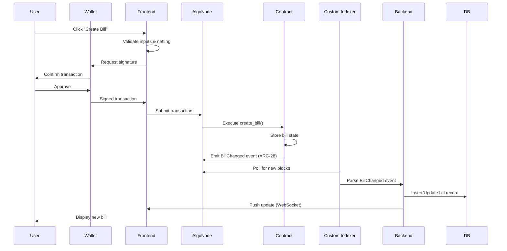

# Splitrix Backend - Custom Indexer & API Server

Backend system for the Splitrix dApp. This includes a custom indexer that syncs Algorand smart contract events to a MySQL database and a REST API server for the frontend.

## Architecture



### Data Flow



---
## 🛡️ Security & Integrity: Why Use a Custom Indexer?

The backend custom indexer is critical for Splitrix's performance and security:

- **Off-chain Computation:** Complex netting calculations and debt aggregation happen off-chain for speed.
- **Performance:** Querying blockchain state directly is slow; the indexer caches data in MySQL for instant access.
- **Queryability:** Enables complex queries (e.g., "show all unsettled bills for user X") that are impractical on-chain.
- **ARC-28 Event Listening:** Ensures on-chain integrity by listening to contract-emitted events, not trusting user input.
- **Auditability:** Every state change is traceable via events, providing a verifiable audit trail.

---

## Setup

1. **Install dependencies**
   ```bash
   pnpm install
   ```
2. **Setup environment variables**
   Copy `.env.sample` to `.env` and configure the database and Algorand node variables.
   ```bash
   cp .env.sample .env
   ```
3. **Setup Database**
   Create a MySQL database named `splitrix`.
    ```bash
    mysql -u root -p -e "CREATE DATABASE splitrix;"
    ```
4. **Run migrations**
   ```bash
   pnpm prisma:migrate
   ```
5. **Start services**
   This will start the API server and the indexer worker.
   ```bash
   pnpm dev
   ```

## Environment Variables

See `.env.sample` for required configuration. Key variables include:
- `INDEXER_URL`
- `ALGOD_URL`
- `ALGOD_TOKEN`
- `DATABASE_URL`
- `PORT`

## API Endpoints

### Groups
- `GET /api/groups` - List all groups (optionally filter by member address)
- `GET /api/groups/:groupId` - Get group details with members
- `GET /api/groups/:groupId/bills` - List bills in a group

### Bills
- `GET /api/bills/:billId` - Get bill details with debtors
- `GET /api/bills/user/:address` - Get all bills for a user

### Balances
- `GET /api/balances/:address` - Get all balances for a user (who owes them, who they owe)

### Analytics
- `GET /api/analytics/user/:address` - User spending analytics
- `GET /api/analytics/group/:groupId` - Group analytics (total spent, by member)

### Helpers (for contract interactions)
- `POST /api/helpers/create-bill-data` - Get formatted data for `create_bill` contract method
  - Body: `{ groupId, payer, debtors: [{ address, amount }], memo }`
  - Returns: Complete data structure with calculated netting opportunities
- `GET /api/helpers/pending-debts/:groupId/:payer` - Get pending debts for a payer in a group
- `GET /api/helpers/group-members/:groupId` - Get all members of a group

### System
- `GET /api/health` - Health check + sync status

