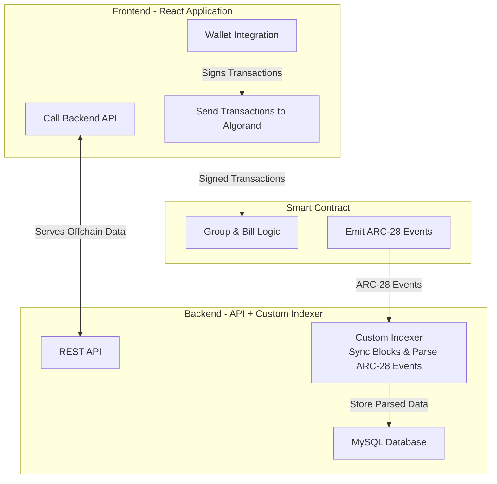

# Splitrix Frontend

This is the frontend for Splitrix, a Web3 expense management dApp built on the Algorand blockchain.

## Overview

Splitrix is a Web3-powered expense management dApp that revolutionizes how friends split bills and manage group funds. Built on Algorand blockchain, it combines the convenience of traditional expense splitting with the power of decentralized finance.

### Key Features
- **Smart Bill Splitting** - Multiple split types with automatic dust handling
- **Dust Pool Investment** - Auto-invest leftover crypto dust into yield farms
- **Democratic Voting** - Anonymous voting for group fund handlers
- **Mobile-First Design** - Responsive interface with QR code integration
- **Web3 Integration** - Full Algorand blockchain integration
- **Modern UI/UX** - Industrial tech aesthetic with black-yellow theme

## Architecture

The frontend is a React application that interacts with the Algorand blockchain for transactions and a backend server for off-chain data and helper functions.



## Tech Stack

### Frontend
- **Next.js 15** - React framework with App Router
- **TypeScript** - Type-safe development
- **Tailwind CSS** - Utility-first styling
- **Radix UI** - Accessible component library
- **Lucide React** - Icons

### Blockchain
- **Algorand** - Fast, secure, and carbon-negative blockchain
- **Algorand SDK** - Official JavaScript SDK
- **use-wallet** - Modern wallet integration
- **AlgoKit** - Development utilities

## Quick Start

### Prerequisites
- Node.js 18+ 
- pnpm

### Installation

1. **Clone the repository**
   ```bash
   git clone https://github.com/NandhaReddy8/Splitrix
   cd Splitrix/projects/splitrix-algorand-frontend
   ```

2. **Install dependencies**
   ```bash
   pnpm install
   ```

3. **Set up environment variables**
   Copy `env.example` to `.env.local` and configure the variables, especially the backend API URL and the smart contract App ID.
   ```bash
   cp env.example .env.local
   ```

4. **Start development server**
   ```bash
   pnpm dev
   ```

5. **Open your browser**
   Navigate to `http://localhost:3000`

## Environment Variables
See `env.example` for required configuration. Key variables include:
- `NEXT_PUBLIC_ALGOD_URL`
- `NEXT_PUBLIC_INDEXER_URL`
- `NEXT_PUBLIC_APP_ID`
- `NEXT_PUBLIC_API_URL`

